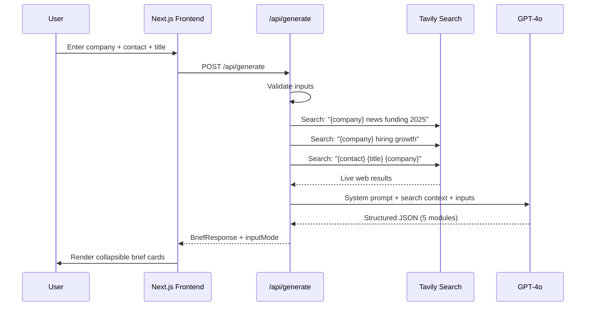

# SDR Pre-Meeting Brief Generator

AI-powered pre-meeting intelligence for sales reps. Enter a company name and contact, get a structured brief in ~12 seconds.

## What it generates

- **Company Snapshot** — live news, funding signals, hiring trends (via Tavily real-time search)
- **ICP Fit Score + Deal Potential** — 1–10 score with rationale and Enterprise/Mid-Market/SMB tier
- **Persona & Competitive Intel** — pain points, likely current solution, displacement angle
- **Meeting Prep** — tailored agenda + 5 discovery questions
- **Objection Handling** — 3 likely objections with suggested responses

## Architecture



## Stack

- [Next.js](https://nextjs.org) (App Router)
- [OpenAI](https://openai.com) — `gpt-4o` for structured brief generation
- [Tavily](https://tavily.com) — real-time web search for live company data
- Deployed on [Vercel](https://vercel.com)

## Run locally

```bash
# 1. Clone and install
git clone <repo-url>
cd brief
npm install

# 2. Add API keys
cp .env.example .env.local
# Edit .env.local and add:
# ANTHROPIC_API_KEY=sk-ant-...
# TAVILY_API_KEY=tvly-...

# 3. Start dev server
npm run dev
# Open http://localhost:3000
```

## Input flexibility

| Company | Contact Name | Title | Result |
|---------|-------------|-------|--------|
| ✓ | ✓ | ✓ | Full 5-module brief |
| ✓ | ✓ | — | Company + limited persona brief |
| ✓ | — | ✓ | Company + persona-level brief |
| ✓ | — | — | Company intel + ICP score only |
